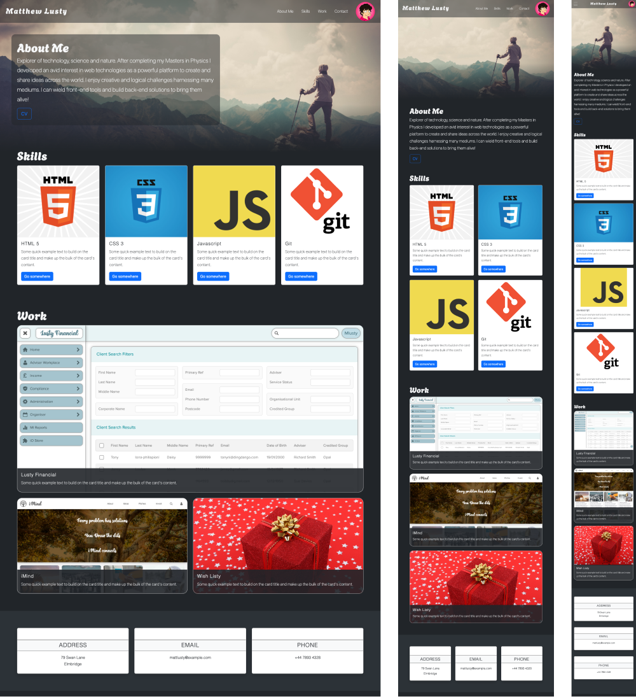

# Bootstrap-Portfolio-bc

## Website

https://mattlusty.github.io/bootstrap-portfolio-bc

## Description

Bootcamp (bc) - Module 3 Challenge.

This is my web developer portfolio - rebuilt using Bootstrap. It contains links to the four sections.

1. About Me
2. Skills
3. Work
4. Contact

## Notes

I made the Hero section reponsively adjust the About Me section to drop below the Hero background image for smaller screen sizes.

I tried to limit additional media queries outside of Bootstrap. I predominantly used a couple of media queries for keeping the Hero image adjusted for all screen sizes, as Bootstrap does not have breakpoint responsive classes for things such as height.
